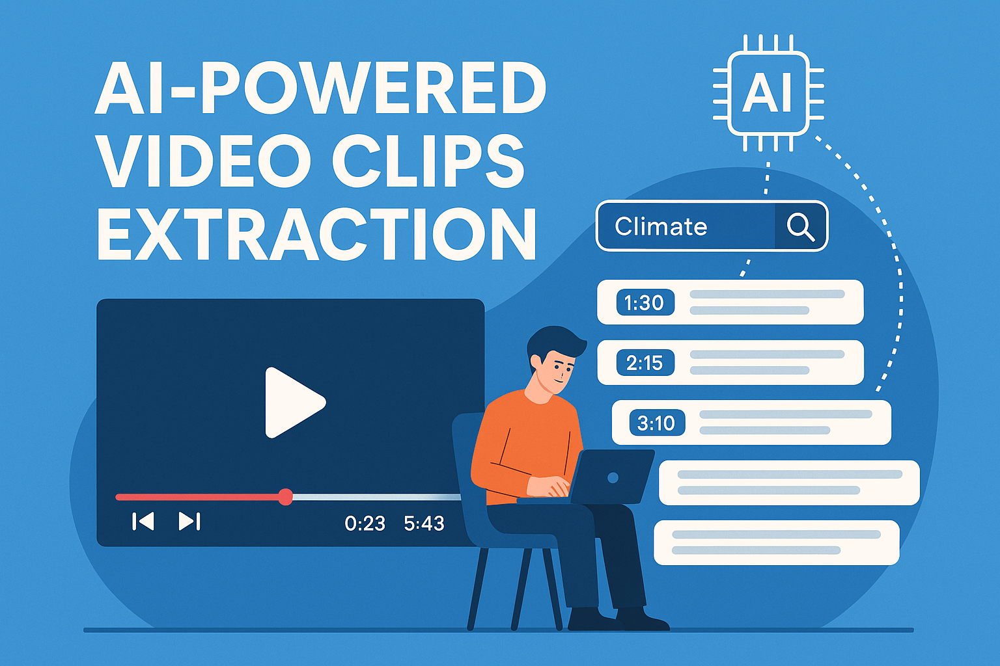

# Clips Extractor




Extract relevant clips from YouTube videos or other media sources based on your topic of interest.

## Features

- Extract clips from YouTube videos or other media sources
- Process media files based on user-provided topics
- Provide extracted clips with timestamps and transcript
- Combine relevant clips into a single video file
- **Chrome Extension**: Extract clips directly while browsing YouTube. Tap on extracted content with its timestamp to play the video from that point. [See Chrome Extension Setup](./chrome-extension-setup.md)

##Demo

[](clips_extractor_chrome_extension_webapp_demo.mp4)


## Architecture

The application consists of:

- **Frontend**: Next.js React application with TypeScript and Tailwind CSS
- **Backend**: Python FastAPI application
- **Media Processing**: FFmpeg, OpenAI Whisper for transcription, and GPT-4 for topic extraction
- **Storage**: AWS S3 for media storage
- **Chrome Extension**: Integrates with YouTube to extract and play clips based on selected content

## Quick Start (Single Command)

You can start both the backend and frontend development servers with a single command using the provided shell script.

### Prerequisites

- Python 3.9+ (with venv and all backend dependencies installed)
- Node.js 18+ and npm (with frontend dependencies installed)
- FFmpeg installed on your system
- Properly configured `.env` files for backend and frontend

### Usage

From the project root directory, run:

```bash
./start-dev.sh
```

This will:
- Start the backend server (FastAPI) on port 8000
- Start the frontend server (Next.js) on port 3000
- Both processes will run in the background and shut down together when you stop the script (Ctrl+C)

## Setup Instructions

### Prerequisites

- Node.js 18+ and npm
- Python 3.9+
- FFmpeg installed on your system
- AWS account with S3 bucket
- OpenAI API key (required for transcription and clip extraction)

### Backend Setup

1. Navigate to the backend directory:
   ```bash
   cd backend
   ```

2. Create a virtual environment and activate it:
   ```bash
   python -m venv venv
   source venv/bin/activate  # On Windows: venv\Scripts\activate
   ```

3. Install dependencies:
   ```bash
   pip install -r requirements.txt
   ```

4. Create a `.env` file based on `.env.example` and fill in your credentials:
   ```bash
   cp .env.example .env
   # Edit .env file with your credentials
   ```
   
5. Required environment variables:
   ```
   # OpenAI Configuration (Required)
   OPENAI_API_KEY=your_openai_api_key
   
   # For local LLMs (Optional)
   # OPENAI_BASE_URL=http://localhost:1234/v1
   
   # AWS Configuration (Required for production, optional for development)
   AWS_ACCESS_KEY_ID=your_aws_access_key
   AWS_SECRET_ACCESS_KEY=your_aws_secret_key
   AWS_REGION=us-west-2
   S3_BUCKET_NAME=clips-extractor-media
   ```

6. Run the backend server:
   ```bash
   uvicorn app.main:app --reload
   ```

### Frontend Setup

1. Navigate to the frontend directory:
   ```bash
   cd frontend
   ```

2. Install dependencies:
   ```bash
   npm install
   ```

3. Create a `.env.local` file:
   ```bash
   echo "NEXT_PUBLIC_API_URL=http://localhost:8000/api" > .env.local
   ```

4. Run the development server:
   ```bash
   npm run dev
   ```

5. Open [http://localhost:3000](http://localhost:3000) with your browser to see the application.

## Chrome Extension

The Chrome extension allows you to extract and play relevant clips directly on YouTube. Tapping on the extracted content with its timestamp will play the video from that point. For setup and usage instructions, see [Chrome Extension Setup](./chrome-extension-setup.md).

## OpenAI API Configuration

This application uses OpenAI's APIs for two key functions:

1. **Audio Transcription**: Uses the `whisper-1` model to transcribe audio from videos
2. **Clip Extraction**: Uses the `gpt-4o-mini` model to identify relevant sections in the transcript

You must provide a valid OpenAI API key in the `.env` file. Without this key, the application will not function properly.

For development with a local LLM, you can set the `OPENAI_BASE_URL` environment variable to point to your local LLM API endpoint.

## Deployment

### Backend Deployment (AWS Lambda)

The backend includes Mangum for AWS Lambda deployment. You can use AWS SAM or Serverless Framework to deploy it.

### Frontend Deployment

You can deploy the Next.js frontend to Vercel, Netlify, or any other hosting service that supports Next.js.
